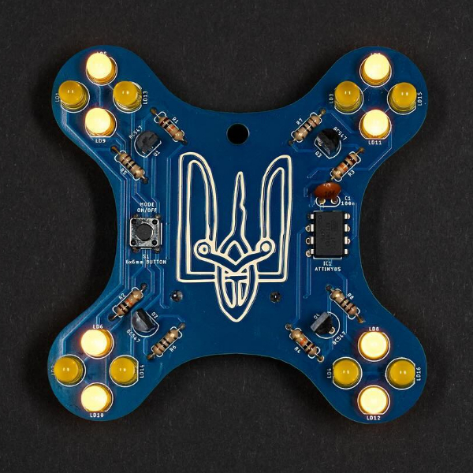

# RSC Drone Badge

A badge (pendant) in the shape of FPV drone which I made for my friends at [Resistance Support Club](http://resistance.support). The collective organizes soldering workshops, the collected money goes to Ukrainian defenders.

Custom designed PCB in Eagle, you can find both design files and gerber archive in the `code` subfolder. You can easily download the ZIP file with gerber and order the PCBs at your favorite PCB manufacturer. Recommended options are: Blue soldermask, ENIG surface.

The board contains ATtiny 25 MCU, you can find a precompiled HEX and shell upload script in `build` folder. Or you can compile it by yourself, eg. to run on another MCU like ATtiny 85. The source files are in the `code` folder, you'll need Arduino IDE with ATTinyCore for compiling them.

In `drawing` subfolder you can find board drawings in Adobe Illustrator format and a PDF with BOM and build instructions.

Слава Україні! 🇺🇦

## License

MIT, feel free to share!